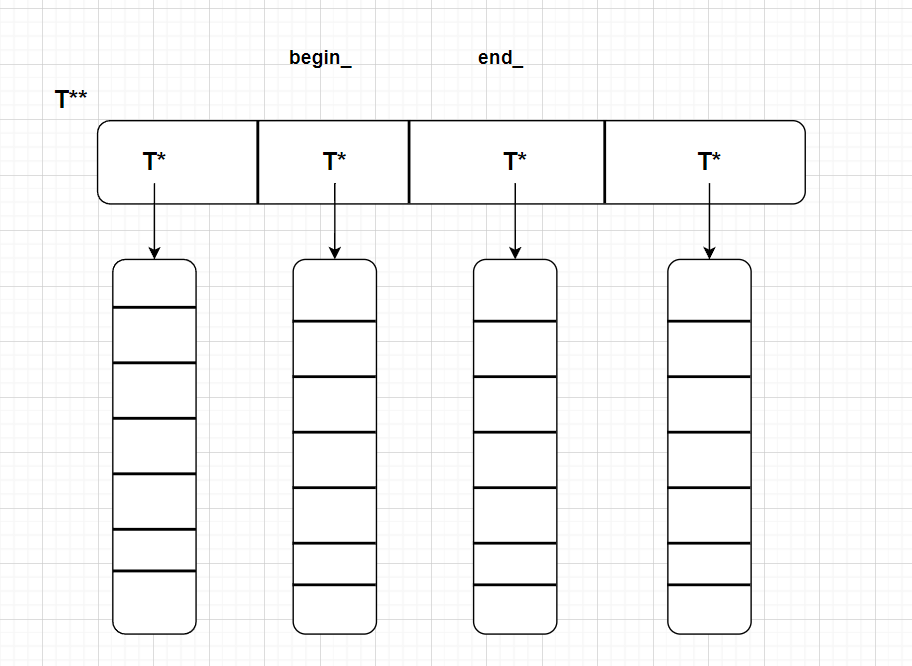
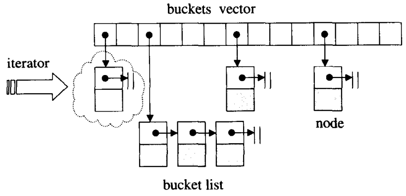

## MyTinySTL 代码注释

---

原项目地址：https://github.com/Alinshans/MyTinySTL

添加了自己写的有bug的内存池https://github.com/myc13381/ConcurrentMemoryPool

> 本项目所有定义均在mystl名称空间下
>
> 代码注释顺序(持续更新)，根据头文件包含情况依次推进
>
> (2023/12/9)type_traits.h -> util.h -> iterator.h -> construct.h -> allocater.h -> exceptdef.h -> functional.h -> algobase.h -> uninitialized.h -> memory.h -> basic_string.h -> astring.h -> list.h -> deque.h -> stack.h -> heap_algo.h -> set_algo.h -> numeric.h -> algo.h -> algorithm.h -> vector.h -> hashtable.h -> unordered_set.h -> unordered_map.h -> rb_tree.h -> set.h -> map.h(2024/1/27) -> queue.h

### 通用头文件

#### type_traits.h

> 该头文件用于提取类的信息

1. 定义了一个模板类`struct m_integral_constant`用来设置一个常量值(true/false)，这个常量值用来进行后续很多模板的判断(SFINAE)。这里使用到了typedef和using关键字，二者都是为一个类型取别名，但用法有所区别。

2. 声明了模板类`pair<T1,T2>`，定义了模板类`is_pair<T>`，这里使用了模板特化技术。

#### util.h

> 该头文件包括一些通用的工具，包括move，forward，swap等函数，以及pair类型等。

1. move和forward函数

   move和forward函数本质操作都是static_cast<T&&>()操作，swap函数可以利用move语义来减少隐式复制操作进而提升性能。

2. pair类型的设计

   在设计pair类型构造函数时，使用了使用SFINAE（Substitution Failure Is Not An Error）(匹配错误不是失败)技术，它通过模板参数的匹配来实现对函数的启用或禁用，这是一种在模板编程中根据条件进行编译时选择的常见技巧。通过 SFINAE，可以在编译时排除那些不符合条件的代码分支。主要使用了`is_default_constructible`,`is_copy_constructible`,`is_convertible`,`enable_if`(以上省略std::作用域)，这些是是C++ 中的类型特性（type trait），头文件是`<type_traits>`

   pair构造函数，主要可以分为三大类，一类是使用first和second来进行构造，第二种是通过另一个pair对象来构造，第三种是默认构造
     每一类构造又分为隐式构造和显式构造(对应那些不允许显式构造的first或者second的类型)，同时又存在复制构造和移动构造两种方式。

   pair相关的运算符重载。

3. 通过模板对类型进行条件判断

   ```cpp
   // 通过一个匿名模板类型进行一个条件判断
   // default constructiable
   template <class Other1 = Ty1, class Other2 = Ty2,
   	typename = typename std::enable_if<
   	std::is_default_constructible<Other1>::value &&
   	std::is_default_constructible<Other2>::value, void>::type>
   constexpr pair(): first(), second(){}
   /*
   在这个构造函数中，第三个模板类型是个匿名类型，而其等号后面的enable_if一但推导结果是false，则会导致其type成员不存在，进而导致模板匹配失败，从而让编译器从匹配函数列表中忽略这个函数，以此达到模板函数选择的功能。
   */
   ```

4. 学习心得

   这里记录下对move函数和forward的使用理解。move函数的意义很明确，就是将一个左值强制转换为右值然后就可以实现了资源的转移或者延长一个右值的生命周期，因此会发现move函数的返回值被明确的规定为`typename std::remove_reference<T>::type&&`；而forward函数，其主要作用是用来实现完美转发，这要求其能够传递原原本本的参数的类型，因此其返回值类型是`T&&`，这样传递左值引用返回左值引用，传递右值引用返回右值引用。

   原作者的forward函数的实现使用了`std::remove_reference<T>::type`来区分forward函数对左值引用和右值引用的分别处理，但是由于C++的引用折叠规则，应该存在一种大一统的做法，即全部使用T&&类型：

   ```cpp
   template <class T>
   T&& forward(T&& arg) noexcept
   {
       return static_cast<T&&>(arg);
   }
   //这个函数即可以接受左值引用也可以接受右值引用
   ```

   在泛型编程中，T 可以是左值引用、右值引用或普通类型

   ```cpp
   template <typename T>
   void myFunction(T&& arg) {
       // 在这里，T 的类型可能是左值引用类型
       // 取决于传递给 myFunction 的实参类型
   }
   int main() {
       int x = 42;
       myFunction(x);  // 在 myFunction 中，T 可能会被推导为 int&
       return 0;
   }
   ```


#### exceptdef.h

> 此头文件包含了头文件 <cassert> 和 <stdexcept>

强制异常保证是指一个函数在出现异常时，程序的状态不会发生任何改变，即不会造成任何资源泄漏或数据不一致的情况。如果一个函数提供了强异常保证，那么在调用该函数时，如果出现了异常，程序会回滚到函数调用前的状态，就好像函数从未被调用过一样。

定义了若干个宏，通过条件判断调用相关异常，并输出相关信息。

```cpp
namespace mystl
{
#define MYSTL_DEBUG(expr) \
  assert(expr)  

#define THROW_LENGTH_ERROR_IF(expr, what) \
  if ((expr)) throw std::length_error(what)

#define THROW_OUT_OF_RANGE_IF(expr, what) \
  if ((expr)) throw std::out_of_range(what)

#define THROW_RUNTIME_ERROR_IF(expr, what) \
  if ((expr)) throw std::runtime_error(what)
} // namepsace mystl
```


#### uninitialized.h

> 此头文件主要用于对未初始化空间的元素构造，目的是提高性能(对内置类型和POD类型来说)


对一段未初始化的空间，此头文件实现了三大类操作：复制(copy/copy_n)，填充(fill/fill_n)，移动(move/move_n)。对于平凡复制可赋值类型，即使是未初始化的空间也可以直接进行比特层面的复制，因此对应的相关实现会调用algobase.h中提供的对应API，而模板参数也会判断出这些类型是平凡复制可赋值类型，进而直接调用`std::memmove`这种底层函数进行比特层面的复制，提高操作效率；

对于非平凡复制可赋值类型，由于其有自己的构造函数且在执行中可能会抛出异常，因此对应的相关实现将会使用constructor.h中的`construct`函数，其内部使用定位new并调用相应的构造函数在指定位置进行构造元素。同时这里使用try....catch结构用于捕获构造时出现的异常，一但发生异常，必须要将之前复制的对象析构，防止内存混乱。

问题：对于未初始化空间元素的构造，这里特地使用了定位new并调用相应构造函数，但是直接使用等号赋值也会调用复制构造函数，所以这里做法是否有点....  一种可能原因是为了使用destroy函数而为了配套使用？

> 平凡复制可赋值类型是一种特殊的类型，它满足了 C++ 标准中对平凡类型（Trivial Type）和可赋值类型（Copy Assignable Type）的一些要求。
>
> 具体而言：
>
> 1. **平凡类型（Trivial Type）**：平凡类型是指具有平凡默认构造函数、平凡拷贝构造函数、平凡移动构造函数、平凡拷贝赋值运算符、平凡移动赋值运算符和平凡析构函数的类型。平凡构造函数是指可以被默认构造函数自动生成的构造函数，而平凡赋值运算符是指可以被默认赋值运算符自动生成的赋值运算符。
>
> 2. **可赋值类型（Copy Assignable Type）**：可赋值类型是指具有赋值运算符的类型，即可以使用 `=` 进行赋值操作。
>
> 因此，平凡复制可赋值类型是同时满足了平凡类型和可赋值类型要求的一类类型。这些类型通常具有简单的拷贝和赋值语义，没有复杂的资源管理行为，使得对它们的操作更为高效。
>
> 在不初始化内存的情况下进行元素的拷贝意味着将源范围的元素复制到目标范围，但是目标范围的内存内容并不会被初始化。这样的设计主要是为了优化性能，避免不必要的初始化开销，尤其是对于一些平凡复制可赋值类型，其元素的复制不涉及到复杂的构造函数和析构函数逻辑。如果在拷贝元素的同时需要初始化内存，通常应该在目标范围的内存上使用适当的构造函数进行初始化。


#### memory.h

> 此头文件负责更高级的动态内存管理，包含一些基本函数，空间配置器，未初始化的存储空间管理，以及一个模板类auto_ptr

1. 模板函数`address_of`

   返回参数中传入对象(引用方式)的地址。

2. `get_buffer_helper`和`get_temporay_buffer`

   `get_buffer_helper`函数用于开辟一段内存，返回内存首地址和对象个数；`get_temporary_buffer`封装了前一个函数。

3. 模板类 `temporary_buffer`

   进行临时缓冲区的申请与释放

4. 模板类 `auto_ptr`

   一个具有严格对象所有权的小型智能指针。其内部封装了一个指针，通过重载`=`,`*`,`->`运算法，提供`get`,`release`,`reset`接口进行指针内部对象赋值转移操作。


---

### 配置器

#### constructor.h

> 此头文件包含两个函数，`construct`和`destory`，分别负责对象的构造和析构

1. 定位new

   ```cpp
   new (pointer) Type [initializer/构造函数];
   // example
   int ptr[10];
   new ((void*)ptr) int(5);
   // 定位new不需要对应delete，因为它不开辟内存空间，只使用已经分配的内存空间
   ```

   定位new允许在指定的内存地址上创建对象，而不分配内存空间，因为你需要预先分配好空间。使用定位new创建的对象需要手动调用析构函数来删除对象。这里使用了`::new`，代表使用全局范围的new关键字而不是类内部重载后的new关键字(如果存在的话)，对于全局delete，则是`::operator  delete`。

2. `std::is_trivially_destructible<Ty>{}`

   此对象用来判断类型Ty是不是平凡可析构类型，如果是则返回std::true_type,如果不是返回std::false_type，如果Ty是平凡析构类型，意味着其析构函数将不会执行任何操作，因此可以不显式调用析构函数。`std::is_trivaially_destructible<Ty>{}`中大括号的作用是创建一个这个类型的匿名变量，使用小括号也可以。


#### allocater.h

> 该头文件包含一个模板类allocater，用于管理内存的分配、释放和对象的构造、析构

allocater类使用了若干个typedef关键字为类型添加新的名称，没有成员变量，但有一些静态共有函数，主要有四类

`allocate`：使用 ::operator new (size) 来申请内存空间

`deallocate`：使用 ::operator delete(ptr) 类释放空间

`construct`：调用construct.h中实现的construct函数

`destroy`：调用construct.h中的destroy函数


---

### 迭代器

#### iterator.h

> 该头文件用于构造迭代器，包含了五种常见的迭代器

1. 定义五种迭代器类型

   ```cpp
   // 五种迭代器类型
   struct input_iterator_tag {};// 单通行单向迭代器，可以递增，但不能倒退
   struct output_iterator_tag {};// 单通行，只写算法
   struct forward_iterator_tag : public input_iterator_tag {};//前向迭代器
   struct bidirectional_iterator_tag : public forward_iterator_tag {};//双向迭代器
   struct random_access_iterator_tag : public bidirectional_iterator_tag {};//随机迭代器
   ```

2. 创建iterator模板

   ```cpp
   // iterator 模板
   // ptrdiff_t表示指针之间的差异，通常用来表示数组元素之间的距离，在Win64中是long long,在其他平台是int
   template <class Category, class T, class Distance = ptrdiff_t,
     class Pointer = T*, class Reference = T&>
   struct iterator
   {
     typedef Category                             iterator_category;//类别
     typedef T                                    value_type;
     typedef Pointer                              pointer;
     typedef Reference                            reference;
     typedef Distance                             difference_type;
   };
   ```

3. 使用SFINAE思想设计一系列模板类用于进行迭代器类型的判断

   ```cpp
   //对其中一些关键部分做一些记录
   // 判断是否有iterator_category属性，这是判别迭代器相关信息的基础，实现方式比较典型的SFINAE做法
   template <class T>
   struct has_iterator_cat
   {
   private:
     struct two { char a; char b; };
     template <class U> static two test(...);
     template <class U> static char test(typename U::iterator_category* = 0);
   public:
     static const bool value = sizeof(test<T>(0)) == sizeof(char);
   };
   /**************************************************************************************************************/
   
   // iterator_tarits_impl结构体用来记录一个迭代器应该拥有的属性
   //第二个模板类型bool实现了模板的选择
   template <class Iterator, bool>
   struct iterator_traits_impl {};
   
   // 这个结构体实现了l类型的复用，将不同迭代器的类型统一定义名称iterator_category,这让后面模板判断出类型后可以得到对应迭代器的实际类型
   template <class Iterator>
   struct iterator_traits_impl<Iterator, true> //这里的true用与模板的判断选择
   { /*一系列类typedef*/ };
   /**************************************************************************************************************/
   
   // iterator_traits_helper是对iterator_traits_impl的进一步封装
   template <class Iterator, bool>
   struct iterator_traits_helper {};
   //通过模板类型的计算来选择不同版本的iterator_traits_impl
   template <class Iterator>
   struct iterator_traits_helper<Iterator, true> //这里的true用与模板的判断选择
     : public iterator_traits_impl<Iterator,
     std::is_convertible<typename Iterator::iterator_category, input_iterator_tag>::value ||
     std::is_convertible<typename Iterator::iterator_category, output_iterator_tag>::value>
   {};
   /**************************************************************************************************************/
   
   // 萃取迭代器的特性 使用模板参数，层层嵌套
   // 对iterator_traits_helper的进一步封装
   template <class Iterator>
   struct iterator_traits 
     : public iterator_traits_helper<Iterator, has_iterator_cat<Iterator>::value> {};
   /*
   传入一个模板类型，通过has_iterator_cat判断这个类型是否用用迭代器类型属性，利用判断结果true/false进一步的进行iterator_traits_helper的构造，获取这个类型应该有的迭代器属性。
   */
   /**************************************************************************************************************/
   
   // 针对原生指针的偏特化版本，这里区分了原生指针和原生const指针
   template <class T>
   struct iterator_traits<T*> { /*一系列typedef*/ };
   
   // 针对const的特化指针版本
   template <class T>
   struct iterator_traits<const T*> { /*一系列typedef*/ };
   /**************************************************************************************************************/
   
   // 一个用于判断两个迭代器的关系的模板类，T是否等于或者向下兼容U类型
   // T是迭代器类型，U也是迭代器类型
   // 这里在两个地方进行的判断,第一是最外层对T类型判断其是否是迭代器(是否有iterator_category这个属性)
   // 第二是判断T的类型是否能隐式转换(向下兼容)为U类型
   // 根据判断结果进行选择继承哪个父类，也就是自己的value值是true还是false
   // 这里利用了std::is_convertible模板类
   template <class T, class U, bool = has_iterator_cat<iterator_traits<T>>::value>
   struct has_iterator_cat_of
     : public m_bool_constant<std::is_convertible<
     typename iterator_traits<T>::iterator_category, U>::value>
   {};
   
   template <class T, class U>   //如果T不是迭代器类型，模板推导到这一步就结束了
   struct has_iterator_cat_of<T, U, false> : public m_false_type {};
   /**************************************************************************************************************/
   
   // 迭代器类型的判断
   // 通过使用has_iterator_cat_of模板类进行判断
   template <class Iter>
   struct is_input_iterator : public has_iterator_cat_of<Iter, input_iterator_tag> {};
   
   template <class Iter>
   struct is_output_iterator : public has_iterator_cat_of<Iter, output_iterator_tag> {};
   
   template <class Iter>
   struct is_forward_iterator : public has_iterator_cat_of<Iter, forward_iterator_tag> {};
   
   template <class Iter>
   struct is_bidirectional_iterator : public has_iterator_cat_of<Iter, bidirectional_iterator_tag> {};
   
   template <class Iter>
   struct is_random_access_iterator : public has_iterator_cat_of<Iter, random_access_iterator_tag> {};
   /**************************************************************************************************************/
   
   // 判断一种类型是不是迭代器
   // input和output迭代器是所有迭代器的基础
   template <class Iterator>
   struct is_iterator :
     public m_bool_constant<is_input_iterator<Iterator>::value ||
       is_output_iterator<Iterator>::value>
   {};
   /*
   这个模板类使用了上面若干个模板类实现了判断一个类型是否是迭代器的功能
   1. 使用模板类has_iterator_cat判断次类型是否有iterator_category属性，如果没有则该类型必然不可能是迭代器；
   2. iterator_traits_impl实现了复用，将不同迭代器的类型统一定义名称iterator_category,这让后面模板判断出类型后可以得到对应迭代器的实际类型
   3. iterator_traits_helper依赖于模板类iterator_traits_impl(继承)，而继承的具体内容是通过模板推导判断的,使用了std::is_convertible判断目标类型是否能强制转化为input_iterator_tag或者output_iterator_tag,因为这两个类型是迭代器的最基础类型；
   4. 使用模板类iterator_traits来获取此类型iterator_category的具体值，而iterator_traits模板类又是在iterator_traits_helper基础上构造而成(继承)；
   5. has_iterator_cat_of模板类通过iterator_traits获取迭代器的类型，然后通过std::is_convertible判断能否进行类型转化，进而通过判断结果进行继承父类m_bool_constant的选择，也就是获得的value属性是true或者false；
   6. 利用has_iterator_cat_of进行各种种类迭代器类型的判断。
   */
   /**************************************************************************************************************/
   
   
   // 定义了若干个模板函数，通过利用iterator_traits模板类获取对应迭代器的各种属性的类型
   
   /**************************************************************************************************************/
   
   // 定义distance_dispatch函数用于计算迭代器之间的距离
   // 函数的设计思路是通过iterator_traits模板类来获取迭代器的种类进而匹配出返回值类型，通过占位参数实现函数的重载(因为不同种类的迭代器例如前向迭代器和随机访问迭代器计算的方式不同，而且因为占位参数的类型不同才能够实现函数的重载)。
   // 最后设计一个以上若干重载函数的封装器，通过调用前面的iterator_category函数获取传入迭代器种类的对象作为第三个参数从而和对应重载函数相匹配。
   /**************************************************************************************************************/
   
   
   // 模板类 : reverse_iterator
   // 代表反向迭代器，使前进为后退，后退为前进
   template <class Iterator>
   class reverse_iterator;
   /*
   内部维护了一个正向迭代器，除了提供了想关构造函数，还重载了需要运算符以达到反向的作用
   */
   ```

4. 学习心得

   这个头文件我阅读了两三天才读完，充分利用的泛型编程的技术来让迭代器做到适配各种类型的功能，泛型编程指在编写独立于数据类型的代码。很多代码的写法对我也有很大启发，例如使用SFINAN思想设计的`has_iterator_cat`模板类，实现了对一种类型T是否拥有一种U类型属性的检测；`iterator_traits_impl`模板类的设计实现了对各种类型的复用，它将模板参数传入的类型的包含的属性的类型使用typedef关键字进行统一的重新命名；`iterator_traits`模板类是对`iterator_traits_impl`的进一步包装，利用`iterator_traits_impl`的类型复用能力，`iterator_traits`可以直接得到传入模板参数类型的包含的属性的类型；在设计模板类时，可以在模板参数中设置一个bool类型参数，然后在特化出该类型参数分别取true、false时不同的内部结构，这样可以更好的配合SFINAE思想使用，当然也不局限于bool类型；使用函数的占位参数来进行函数的重载，再设计一个函数通过对传入类型的判断动态选择函数重载等；对于++和--运算符的重载，由于分为前缀版本和后缀版本，以++为例，`operator++(void)`是前缀版本，`operator++(typename)`作为后缀版本，--运算符相同。

   **问题**：整个文件都是在构造模板类，但是在迭代器的设计中并没有看到一些基本数据类型的定义，所以这些迭代器应该并不是实体，其中只包含了对一下类型的定义，这也让我对迭代器运算符重载感到不解，但愿在后续代码阅读中可以注解解开这些疑惑。(2023.12.11)


---

### 仿函数

#### functional.h

> 该头文件主要实现两个功能，函数对象和哈希函数

1. 函数对象的设计

   首先定义了两个模板类用于对不同类型进行统一重命名，通过继承这两类，可以动态获得模板参数类型(如果是类或者结构体)包含属性的类型，设计思想参考iteraotr.h中的`iterator_traits`。

   ```cpp
   // 定义一元函数的参数型别和返回值型别
   template <class Arg, class Result>
   struct unarg_function
   {
     typedef Arg       argument_type;
     typedef Result    result_type;
   };
   
   // 定义二元函数的参数型别的返回值型别
   template <class Arg1, class Arg2, class Result>
   struct binary_function
   {
     typedef Arg1      first_argument_type;
     typedef Arg2      second_argument_type;
     typedef Result    result_type;
   };
   ```

   通过重载结构体的()运算符来实现仿函数，注意这里将运算符重载函数设置为const，代表该函数不会改变结构体的状态

   > 证同元素（identity element），所谓“运算op的证同元素”，意思是数值A若与该元素做op运算，会得到A自己。

   [C++中四种类型转换运算符](https://c.biancheng.net/view/410.html)，通用使用语法`typename name = XXX_cast<typename> (expression)`，转换出错返回空值。

   1. `dynamic_cast`：使得能够在类层次结构中进行向上转换（由于is-a关系，这样的类型转换是安全的），如果基类向派生类转换，则会返回nullptr，他只能转换指针或者引用；
   2. `const_cast`：该运算仅仅用于同类型中const与volatile两种状态的转换。
   3. `static_cast`：最通用的类型转化，如基本类型就(包括枚举值)之间的互相转化；void*到其他指针类型的转换；子类到父类的所有转换，父类到子类的引用或者指针转换，注意没有直接关系的类之间无法使用`static_cast`进行转换等等如果需要检查请使用`dynamic_cast`。注意`static_cast`不会做类型检查。
   4. `reinterpret_cast`：最危险的一种类型转换，仅仅做了比特层面的复制而不做任何类型检查。`reinterpret_cast `用于进行各种不同类型的指针之间、不同类型的引用之间以及指针和能容纳指针的整数类型之间的转换。转换时，执行的是逐个比特复制的操作。

2. 哈希函数

   对于整型类似类型以及指针类型，全部转换为`size_t`类型；对于float和double类型，没看懂。所以这里的哈希函数到底为了做什么。


---

### 容器

#### basic_string.h

> 此文件实现了一个了一个模板类basic_string，用于表示字符串类型

1. 基本功能

   字符串类型虽然是一个模版类型，但是其元数据均是一个个字符

   ```cpp
   // C++中常见的字符类型
   char     ch1{ 'a' };  // or { u8'a' }
   wchar_t  ch2{ L'a' };
   char16_t ch3{ u'a' };
   char32_t ch4{ U'a' };
   ```

   因此在此文件的开始位置，先实现了对于这些字符组成的C语言类型字符串(字符数组但是最后一个是0)的一些基本操作，如求长度，比较字符串，复制字符串，移动字符串，填充字符串的功能，方便后续的实现。

2. 类型重命名

   利用typedef关键字重新对类型进行命名，使后续编写代码时逻辑更加清晰，这里列举一二：

   ```cpp
     // traits_type本身就是CharTraits
     typedef CharTraits                               traits_type;
     typedef CharTraits                               char_traits;
   
     typedef mystl::allocator<CharType>               allocator_type;
     typedef mystl::allocator<CharType>               data_allocator;
   
     typedef typename allocator_type::value_type      value_type;
     typedef typename allocator_type::pointer         pointer;
     typedef typename allocator_type::const_pointer   const_pointer;
     typedef typename allocator_type::reference       reference;
     typedef typename allocator_type::const_reference const_reference;
     typedef typename allocator_type::size_type       size_type;
     typedef typename allocator_type::difference_type difference_type;
   
     // //以上类型定义这样写也可以
     // typedef typename CharType           value_type;
     // typedef typename CharType*          pointer;
     // typedef typename const CharType*    const_pointer;
     // typedef typename CharType&          reference;
     // typedef typename const CharType&    const_reference;
     // typedef typename size_t             size_type;
     // typedef typename ptrdiff_t          difference_type;
   // 省略........
   ```

3. 字符串的基本类型必须是POD类型

   编译时期进行类型判断

   ```cpp
   // 字符类型必须是POD类型
   static_assert(std::is_pod<CharType>::value, "Character type of basic_string must be a POD");
   // CharType类型需要和traits_type对应的字符类型保持一致
   static_assert(std::is_same<CharType, typename traits_type::char_type>::value,
                "CharType must be same as traits_type::char_type");
   ```

4. 字符串的主要属性

   ```cpp
   private:
     iterator  buffer_;  // 储存字符串的起始位置
     size_type size_;    // 大小
     size_type cap_;     // 容量
   ```

   因为字符串本质是个简单的容器，不需要太多的属性，很多功能通过函数实现。

   同时basic_string使用了前面实现的内存分配器alloctor来实现对缓冲区的申请，释放与改变。

   从第2点可以看出，字符串的迭代器类型就是组成其的基本字符类型的指针。

5. 构造函数，析构函数，运算符重载

6. 提供的功能

   提供了较为丰富的功能，如容量操作(empty,clear,earse,resize等)，拼接操作(appand,substr等)，比较操作(compare,运算符)，查找操作(find,rfind等)，并且均为这些方法提供了不同参数的重载版本已适应大部分编写代码的需求。其实这些功能也基本都是1中提到的基本功能的封装。


#### astring.h

> 该文件定义了 string, wstring, u16string, u32string 类型，内容比教简单

```cpp
#include "basic_string.h"
namespace mystl
{
    using string    = mystl::basic_string<char>;
    using wstring   = mystl::basic_string<wchar_t>;
    using u16string = mystl::basic_string<char16_t>;
    using u32string = mystl::basic_string<char32_t>;
}
```


#### list.h

> 此文件包含了一个模板类list，list是一个逻辑上的双向链表

由于list和string同为容器，所以二者设计有其相似的地方。

1. 节点类设计

   有两种节点类：`list_node_base`和`list_base`，前者内部只维护了前向指针和后向指针，后者继承了前者但额外提供了一个数据域用来存储数据。节点类有自己的相关功能，除了构造析构函数，重载运算符等，还有如断开自己与链表的连接，两种节点类型之间的强制类型转换等功能。

2. 迭代器设计

   迭代器内部维护了一个`list_node_base *`类型的指针变量。迭代器通过重载相关运算符来让迭代器类型实现类似于指针的功能。同时此迭代器继承了`mystl::iterator<mystl::bidirectional_iterator_tag, T>`，让他可以使用iterator.h中提供的相关功能。

3. 链表设计

   1. 与string一致，在list类设计的最开始部分依然是一连串的类型别名定义。

   2. list内部维护两个关键的数据：`node_`和`size_`

      `node_`是此链表的尾结点，从逻辑上类看此节点是不存在的，但是它去通过前向指针和后向指针将此双向链表连接成了一个环形双向链表，由于成环，因此我们便可以通过`node_->next`和`node_->prev`来获取逻辑链表的第一个节点和最后一个节点。而`node_->next`就是此链表的`begin()`，而`node_`就是`end()`。

      `size_`是链表的长度，可以用来实现`empty()`等函数。

   3. 构造和析构函数，重载=运算符

      链表本质上是由一连串指针构成的。

      对与一个空的链表，其内部只有一个`node_`节点，且自行成环，`size_=0`。构造链表的操作就是为节点申请内存并创建，插入这些节点。

      析构的链表的操作则由两部分构成，第一部分是先将链表中节点内之中存放的对象释放(保证资源的正确释放)，第二步便是将节点自身占用的内存释放。

      对于重载等号运算符，这里提供了一种assgin语义，当我们使用另一个链表对当前链表重新赋值是，我们可以考虑利用当前链表已经存在的节点而不是销毁这些节点后再全部创建新的节点。

   4. 对链表提供的操作

      主要包含了链表的插入，删除，清空，拼接，合并，反转，排序(归并排序)等。起最基本的操作就是节点的插入与删除，因此我们封装两个函数`link_nodes`和`unlink_nodes`实现对某个节点或者连续的若干个节点的插入与删除。这样在编写其他函数时直接调用这两个函数，可以简化思路。

4. 仿函数的使用

   这里解释了我长久以来的困惑，为什么传入less反而是递增排序。

   ```cpp
   // 函数对象：小于
   template <class T>
   struct less :public binary_function<T, T, bool>
   {
     bool operator()(const T& x, const T& y) const { return x < y; }
   };
   
   void merge(list& x)
   { merge(x, mystl::less<T>()); }
   template <class Compare>
   void merge(list& x, Compare comp);
   ```

   在merge函数中，调用comp函数时，comp第一个参数是外部参数x对应链表的节点，第二个参数才是自己的节点，而less的含义是如果第一个参数比第二个小，则返回true，此时merge函数中如果外部结点比自己当前节点要小，插入，因此最后显现出来时递增排序。(这里语言可能比较混乱，建议看看源码)

5. 一点感想

   在STL容器的函数设计上，大量运用了函数重载的方法，这是为了让一种操作适用于多种场景。例如某些时候你可以传递一个迭代器，也可以穿两个迭代器代表一个区间，也可以传递一个迭代器加上一个长度代表一个区间。

#### deque.h

> 此文件包含模板类deque

1. 关于deque

   deque被称为双端数组，既可以在数组头部和尾部插入和删除元素，也可以在中间位置插入和删除。

   deque容器在逻辑上是连续的，而实际上他是由动态的若干个连续小空间组合而成，通过对迭代器的精心设计，可以让它操作起来看成是连续的一样。

   虽然deque两端可操作，但是在排序查找方面远不如vector，因此如果有需要，还是用vector。

   

   deque的控制器是一个由对应成员类型指针组成的数组，被称为map，其内部的每一个一级指针指向一个缓冲区。`begin_`和`end_`是deque类型的迭代器，其内部的节点分别对应存有元素节点的第一个和最后一个。

2. deque迭代器的设计

   前面提到过，deque内部的元素只是在逻辑上连续，而非实际连续。迭代器是我们访问容器中元素的工具，因此迭代器需要给我们提供这种存储的元素在逻辑上连续的假象。

   ```cpp
   // deque迭代器类的核心成员变量  
   // 迭代器的缓冲区大小，在项目中该值固定取8
   static const size_type buffer_size = deque_buf_size<T>::value;
   // 迭代器所含成员数据
   T *cur;    // 指向所在缓冲区的当前元素
   T *first;  // 指向所在缓冲区的头部
   T *last;   // 指向所在缓冲区的尾部
   T **node;  // 缓冲区所在节点
   ```

   因为一个迭代器指向一个元素，所以为了获得这个元素，我们就需要知道其所在缓冲区(node)，其在缓冲区中的位置(cur)，同时为了方便迭代器操作，记录了当前元素所在缓冲区的头尾(first和last)，接下来要做的就是对相关运算符进行重载。例如对迭代器的*操作显然是`*cur`操作，而迭代器的加减操作，除了改变cur还需要考虑是否需要切换到其他缓冲区即改变node,first,last值，同时对deque的迭代器距离的计算也是极为特殊点，因为逻辑上元素的连续的，因此迭代器也需要模拟这种连续，所两个迭代器间的距离也需要模拟在连续情况下的结果。具体可以看看迭代器相关操作符定义的源码。

3. deque容器的设计

   deque的设计方案如上图，因此可以容易得到deque的核心成员变量

   ```cpp
   // deque容器的核心成员变量
   iterator       begin_;     // 指向第一个节点
   iterator       end_;       // 指向最后一个结点
   map_pointer    map_;       // 指向一块 map，map 中的每个元素都是一个指针，指向一个缓冲区 
   size_type      map_size_;  // map 内指针的数目
   ```

   map_pointer类型是`T **`。为了构建出来一个deque我们需要做一下操作：

   1. 首先我们要创建map，即在堆区开辟一个一级指针的数组，对应函数`creat_map`。
   2. 为每一个一级指针开辟其对应的缓冲区，对应函数`creat_buffer`。
   3. 设置好迭代器`begin_`和`end_`的值。

   以上操作就是函数`map_init`所实现的功能。

   除此之外，还需要为容器提供前后位置插入删除(emplace_front,emplace_back,pop_front等)，中间位置插入和删除(insert,erase等)，容量操作等。

   在容量操作方面，如果我们想让deque容量变大，操作方法只能是重新创建一个更长的map，但是缓冲区可以复用，只需要让新的map中的指针重新指向之前的缓冲区即可。

4. 为了提高性能的一些操作

   在中间插入元素时，我们可以有两种选择：让插入位置前方的元素向前移动或者让插入位置及其后方的元素向后移动，为了提高性能我们选择移动数量少的一方。有时候插入元素数量较多我们需要让容器容量增加，这时候就有两种选择：新加入的缓冲区是放在原来的头部之间还是放在原来的尾部之后，这个选择也决定后面移动插入位置前方的元素还是插入位置后方的元素。**注意**，在插入元素时如果出现新开辟空间并将原有元素复制到新空间时，需要使用`uninitialized_copy`来复制，这样更安全因为该函数在指定位置通过构造函数构造元素而指向了初始化操作，而普通的`copy`函数只是单纯的通过调用`std::memmove`函数实现复制。

5. 问题

   `clear`函数实现功能似乎不及预期，因为他只是为原来所有的元素执行了析构操作，将`begin_`之前和`end_`之后的空间释放，但并没有将其他的空间释放掉。而deque的析构操作除了释放了`end_`执向的节点，并无其他操作，这有很大可能导致内存泄漏。所以我认为：

   `~deque`函数需要重写，`operator=(deque&& rhs)`函数也需要重写，因为其也会导致内存泄漏，`clear`需要重写，因为他似乎并未完成应该完成的使命。


#### vector.h

> 此文件实现了模板类 vector

1. 关于vector

   vector是一个可变长度的模板数组。vector变长的操作是a.开辟新的更大空间b.移动数据至新空间c.销毁原来的空间

2. vector设计

   vector其实十分简单，下面列出核心数据结构

   ```cpp
   iterator begin_;  // 表示目前使用空间的头部
   iterator end_;    // 表示目前使用空间的尾部
   iterator cap_;    // 表示目前储存空间的尾部
   ```

3. vector操作

   vector就维护了一个数组，因此只需要维护上面三个属性来操作数组即可。vector很多操作都是复制，移动，插入等，因此用到了很多了algobase.h和uninitialized.h中实现的算法。

4. 学习心得

   注意区分已初始化空间中元素的构造和未初始化空间中元素的构造，合理的进行调用将有助于程序性能的提升。
   
   emplace_back和push_back的区别，前者直接原地构造，即只调用一次构造函数，因为传入的参数会变成构造函数的参数，后者则是进行复制构造


#### hashtable.h

> 此文件实现了模板类hashtable，使用开链法处理冲突

> 补充，开链法处理冲突的优势和缺点
>
> 。。。。

1. 关于hashtable(哈希表)

   Hashtable是一种关联数组，也称为哈希表。它使用一个下标范围比较大的数组来存储元素，并通过散列函数将元素的关键字映射到数组的某个位置，以加快查找速度。

   

   上图是hashtable的设计框架。通过一个vector容器存放一系列指针被称为桶，每个桶存放一个链表。vector的索引就是键值通过哈希函数通过键值计算出的索引值。通过索引直接定位到链表之中，然后从链表中再次询查，以此加快查找。（开链法）

2. hashtable节点的设计

   因为这里hashtable本就是一个vector内部存储多个链表，所以节点自然就是链表的节点。因为节点只是最基本的元素，因此设计很简单

   ```cpp
   // hashtable 的节点定义
   template <class T>
   struct hashtable_node
   {
     hashtable_node* next;   // 指向下一个节点
     T               value;  // 储存实值
   
     hashtable_node() = default;
     hashtable_node(const T& n) :next(nullptr), value(n) {}
   
     hashtable_node(const hashtable_node& node) :next(node.next), value(node.value) {}
     hashtable_node(hashtable_node&& node) :next(node.next), value(mystl::move(node.value))
     {
       node.next = nullptr; // 剥夺原有的资源
     }
   };
   ```

   这里的链表是单向链表，头结点便是bucket vector中的对应位置的指针指向的节点。

   对于hashtable，一般有两种使用方法。第一种对应的时STL中的set，存入的元素既作为键值，也作为实际存储的元素，第二种是对应STL中的map，一般是传入一个`pair<T1,T2>`类型的元素，第一个参数是键值，第二个则是实际存储的元素。因此hashtable_node中value分别对应的类型应该是存储值的类型(set)和存储键与值的pair类型(map)。

3. hashtable迭代器的设计

   迭代器实际上是对指针的封装，由于hashtable最基本的元素是一个个节点，所以迭代器自然需要维护一个指向节点的指针，同时每个节点都会和组织这些链表的vector有很大关系，所以迭代器自然也需要保存一份vector的地址，所以迭代器基本要素设计如下：

   ```cpp
   template <class T, class Hash, class KeyEqual>
   struct ht_iterator_base :public mystl::iterator<mystl::forward_iterator_tag, T> // 继承前向迭代器
   { 
     // 省略一些类型名称声明
   
     node_ptr    node;  // 迭代器当前所指节点
     contain_ptr ht;    // 保持与容器的连结
   
     ht_iterator_base() = default;
   
     bool operator==(const base& rhs) const { return node == rhs.node; }
     bool operator!=(const base& rhs) const { return node != rhs.node; }
   };
   ```

   很显然，hashtable的迭代器因该不是随机迭代器的类型而是普通的forward_iterator，因此其主要功能就是能够连续不断地访问本元素和下一个元素。哈希表又称为散列表，其元素存储往往是分散的，因此vector bucket中的连续位置上可能存在一些空指针，为了正确实现迭代器的移动操作，当从一个桶中出来后，必须要不断向下查找下一个存在元素的桶，除非之后已经没有元素。同理，对于hashtable的一个范围如[first,last)，迭代器first指向此区间的第一个元素，迭代器last指向此区间的下一个元素，因此last不是下一个节点，而是下一个存在元素的节点，除非后面没有元素。关于hashtable的end位置，一般使用nullptr来表示即可。

4. hashtable的设计

   1. 模板参数

      ```cpp
      // 模板类 hashtable
      // 参数一代表数据类型，参数二代表哈希函数，参数三代表键值相等的比较函数
      template <class T, class Hash, class KeyEqual>
      class hashtable{ /*...*/};
      ```

   2. vector bucket的大小

      vector bucket的长度都是质数(这是因为质数的性质使得它们在取模运算中具有较好的散列效果，可以更好地利用哈希表的容量)。

   3. hashtable的核心成员变量

      ```cpp
      // 用以下六个参数来表现 hashtable
      bucket_type buckets_; 		// vector<hashtable_node<T> *> 存放所有桶的数组，使用vector作为容器
      size_type   bucket_size_; 	// size_t  使用的bucket的个数
      size_type   size_;			// 所有存放的节点个数
      float       mlf_;			// max load factor 最大负载因子
      hasher      hash_; 			// 函数对象，hash函数
      key_equal   equal_; 		// 键值相等的比较函数
      ```

      负载因子lf(load factor)的计算方法为`lf=size/bucket_size_`，描述的是哈希表中已存储元素数量与总容量之间的比率，当负载因子过高，将导致哈希表碰撞几率增加，从而导致性能的下降，此时需要进行rehash操作，也就是扩充hashtable并且重新映射。

   4. 关键函数

      1. hash

         调用我们传入的hash函数计算键值对应的索引，当然为了保证索引合法，需要对bucket_size_进行取余，

         ```cpp
         template <class T, class Hash, class KeyEqual>
         typename hashtable<T, Hash, KeyEqual>::size_type
         hashtable<T, Hash, KeyEqual>::
         hash(const key_type& key) const
         {
           return hash_(key) % bucket_size_;
         }
         ```

      2. replace_bucket

         此函数实现了扩充或者缩小hashtable的功能，通过构建其他长度的vector bucket并通过重新hash计算索引将原来的hashtable更新并替换。

         ```cpp
         // replace_bucket 函数
         template <class T, class Hash, class KeyEqual>
         void hashtable<T, Hash, KeyEqual>::
         replace_bucket(size_type bucket_count)
         {
           bucket_type bucket(bucket_count); // 在栈上建立临时vector，长度为bucket_count
           if (size_ != 0)
           {
             for (size_type i = 0; i < bucket_size_; ++i)
             {
               for (auto first = buckets_[i]; first; first = first->next)
               {
                 auto tmp = create_node(first->value); // 创建将要插入的新节点
                 const auto n = hash(value_traits::get_key(first->value), bucket_count); // 使用新的bucket_count计算新的hash索引
                 auto f = bucket[n]; // 找到新桶的起始位置，该位置可能已经存在元素
                 bool is_inserted = false;
                 for (auto cur = f; cur; cur = cur->next)
                 {
                   if (is_equal(value_traits::get_key(cur->value), value_traits::get_key(first->value)))
                   { // 相同键值的元素放到一起
                     tmp->next = cur->next;
                     cur->next = tmp;
                     is_inserted = true;
                     break;
                   }
                 }
                 if (!is_inserted) // 没有找到相同键值的元素，插入到桶的头部
                 {
                   tmp->next = f;
                   bucket[n] = tmp;
                 }
               }
             }
           }
           buckets_.swap(bucket);
           bucket_size_ = buckets_.size();
         }
         ```

      3. rehash

         通过当前vector bucket是否够用以及负载因子来决定是否重新构建hashtable，内部调用replace_bucket并提供合适的参数。

      4. 主要接口

         1. `find`：查找一个元素，具体的流程是首先通过key值使用hash函数计算出对应桶的索引，在该桶中通过线性查找的方式通过模板参数中的`keyEqual`函数判断是否是我们需要的元素。
         2. `count`：统计key键值对应元素的个数

5. 学习心得

   1. 实现hashtable相关函数需要特殊处理的地方

      比如当需要删除节点时需要考虑此节点是否是桶中第一个节点还是后面的节点，这两种情况的处理有所差异；再比如一个区间的尾部(不包含)需要是一个存有元素的其他节点而不是最后一个元素的下一个节点。因此在返回区间时需要特殊处理尾结点的不同情况。

   2. 由于存在unique和multi两种情况，unique不允许键值重复而multi允许键值重复。对于multi的情况，如果插入相同键值的元素，则需要将这些元素的节点放在一下，方便询查和删除。

   3. hashtable内部使用了vecotr容器，隐藏了数组动态增长的细节，实现起来更简单。

   4. 复制赋值运算符的设计思想，尽量利用已经开辟的存储空间而避免额外开辟空间，例如链表就可以使用类似于assgin的语义，但是向hashtable存储大小相对固定且二者区别大概率不大，所以直接使用栈中构建临时元素加swap大法即可实现。

   ​      

   

#### unordered_set.h

> 此文件实现了两个模板类：unordered_set和unordered_multiset

`unordered_set`，无序集合，不允许键值重复。实现的方式就是封装了hashtable的一部分接口。

`unordered_multiset`，无序可重复集合，允许键值重复。实现的方式也是封装了hashtable的一部分接口。

问题：这两个模板类的`operator==`和`operator!=`操作我没看懂。


#### unordered_map.h

> 此文件实现了两个模板类：unordered_map和unordered_multimap

`unordered_map`，无序映射，不允许键值重复。

`unordered_multimap`，无序可重复，允许键值重复。

和无序集合一样，封装了hashtable的一部分接口。

学习心得：关于这两个模板类`at`接口和`operator[]`接口的不同点，以`unordered_map`为例

```cpp
  mapped_type& at(const key_type& key)
  {
    iterator it = ht_.find(key);
    THROW_OUT_OF_RANGE_IF(it.node == nullptr, "unordered_map<Key, T> no such element exists");
    return it->second; // 返回对应的值
  }

  mapped_type& operator[](const key_type& key)
  {
    iterator it = ht_.find(key);
    if (it.node == nullptr)
      it = ht_.emplace_unique(key, T{}).first; // 插入一个默认构造的元素，这也是map使用at和[]取值的区别
    return it->second;
  }
```

**由源代码可以看出，at接口为了安全，当输入键值对应迭代器指向节点为空时直接抛出异常；而`operator[]`则会在空节点处调用默认构造函数构建元素然后返回。这在使用无序映射是是一个值得注意的地方。**


#### rb_tree.h

> 此文件实现模板类rb_tree，红黑树

参考博客:	

​	https://blog.csdn.net/cy973071263/article/details/122543826

​	http://blog.csdn.net/v_JULY_v/article/details/6105630

​	http://blog.csdn.net/v_JULY_v/article/details/6109153

1. 关于红黑树

   * 简介

     红黑树是一种自平衡的二叉查找树，是一种高效的查找树。它是由 Rudolf Bayer 于1978年发明，在当时被称为平衡二叉 B 树(symmetric binary B-trees)。后来，在1978年被 Leo J. Guibas 和 Robert Sedgewick 修改为如今的红黑树。红黑树具有良好的效率，它可在 O(logN) 时间内完成查找、增加、删除等操作。红黑树是具备了某些特性的二叉搜索树，能解决非平衡树问题，红黑树是一种接近平衡的二叉树（说它是接近平衡因为它并没有像AVL树的平衡因子的概念，它只是靠着满足红黑节点的5条性质来维持一种接近平衡的结构，进而提升整体的性能，并没有严格的卡定某个平衡因子来维持绝对平衡）。

   * 名称

     parent：父节点

     slibling：兄弟节点

     uncle：叔父节点

     grand：祖父节点

   * 特性

     1. 节点是红色或者黑色

     2. 根是黑色

     3. 叶子结点(全部为NULL，外部节点)都是黑色

     4. 红色节点的子节点的子节点都是黑色

        红色节点的父节点都是黑色

        从根节点到叶子节点的所有路径上不能有2个连续的红色节点

     5. 从根节点到任意叶子节点的所有路径都包含相同数目的黑色节点

     推论：红黑树的最短路径(如果存在)则全部由黑色节点构成，最长路径(如果存在)则是黑红交错构成。

   * 效率

     红黑树的查找、插入和删除操作时间复杂度都是O(logN)

   * 等价变换

     红黑树可以等价变化为4阶B树(2-3-4树，我们可以将黑色节点和其下方的红色节点看为统一层次)，这是由其五条约束形成的，这也是为什么红黑树能够维持平衡的原因。

   * 旋转

     左旋：将某个节点旋转为其右孩子的左孩子。

     右旋：将某个节点旋转为其左孩子的右孩子。

     通过左旋右旋或者两者相互配合，可以实现节点位置的转换，这在插入节点时使用颇多。

   * 插入

     插入操作基本都是插入在原叶子节点(NULL)原来的位置，而且我们默认插入红色节点

     * 插入到黑色节点之下

       这种情况不需要做额外的处理，只需要将加入的节点设置为红色即可，因为红色节点并不影响红黑树的结构。

     * 插入红色节点之上

       由于不允许在路径上存在两个连续的红色节点，因此在这种情况下插入后，红黑树被破坏需要做出调整。这里判断的是插入节点的叔父节点(父节点的兄弟)，并且可以知道祖父节点必然为黑色节点。

       * 叔父节点为红色

         这种情况的本质是红黑树对应的4阶B树的此节点超过了对应的容量范围，解决办法是将插入节点的祖父节点Grand向上合并，其实也就是变相的将祖父节点插入到上面的“层面”中本质来说就是将祖父节点由黑色变为红色，这是上层可能仍然会出现溢出，因此需要递归的向上合并，直到不溢出为止(最后的结果就是从头部新增加出一个头节点)。当然由于叔父节点已经在整个红黑树结构中，因此只需要对指定节点重新染色即可。

       * 叔父节点不为红色(黑色或者不存在)

         这种情况并没有发生溢出，通过旋转调整节点位置

       综合上面两种情况，给出处理方案

       ```cpp
       // case 1: 新增节点位于根节点，令新增节点为黑
       // case 2: 新增节点的父节点为黑，没有破坏平衡，直接返回
       // case 3: 父节点和叔叔节点都为红，令父节点和叔叔节点为黑，祖父节点为红，
       //         然后令祖父节点为当前节点，继续处理(溢出情况，祖父节点向上合并)
       // case 4: 父节点为红，叔叔节点为 NIL 或黑色，父节点为左（右）孩子，当前节点为右（左）孩子， LR/RL
       //         让父节点成为当前节点，再以当前节点为支点左（右）旋
       // case 5: 父节点为红，叔叔节点为 NIL 或黑色，父节点为左（右）孩子，当前节点为左（右）孩子， LL/RR
       //         让父节点变为黑色，祖父节点变为红色，以祖父节点为支点右（左）旋
       ```

       

   * 删除

     * 首先记录一下删除数的节点的基本操作，假设删除节点为B，其父节点为A，两个子节点为C、D：

       * 删除节点B为叶子结点，此时CD其实不存在，因此只需要将A的这个子节点设置为NULL即可；

       * 删除节点B只有一个子节点，假设为C，则D为NULL。此时只需要将A原来指向B的指针指向C即可；
       * 删除节点B有两个子节点，则可以将左孩子为根的子树中的最大节点或者将右孩子为根的子树中的最小节点放在代替B所在位置即可，注意这里的代替节点一定是最底层的节点，所以代替操作并不复杂。

     * 红黑树由于受到特性的约束，所以除了不同的删除，还特定情况下还需要进行一些调整

       > “上面的修复情况看起来有些复杂，下面我们用一个分析技巧：我们从被删结点后来顶替它的那个结点开始调整，并认为它有额外的一重黑色。这里额外一重黑色是什么意思呢，我们不是把红黑树的结点加上除红与黑的另一种颜色，这里只是一种假设，我们认为我们当前指向它，因此空有额外一种黑色，可以认为它的黑色是从它的父结点被删除后继承给它的，它现在可以容纳两种颜色，如果它原来是红色，那么现在是红+黑，如果原来是黑色，那么它现在的颜色是黑+黑。有了这重额外的黑色，原红黑树性质5就能保持不变。现在只要恢复其它性质就可以了，做法还是尽量向根移动和穷举所有可能性。"--saturnman。

       * 删除的是红色节点，则无需额外调整，只需要像正常二叉树搜索删除节点一样操作即可；

       * 删除的黑色节点

         * 代替节点是红色节点或者删除的是黑色根节点

           直接将代替节点染成黑色，结束

         * 代替节点是黑色节点，因此代替节点之前所在位置必然不平衡，所以需要调整

           * 1. 当前结点是黑+黑且兄弟结点为红色(此时父结点和兄弟结点的子结点分为黑)

                令父节点为红，兄弟节点为黑，进行左（右）旋，继续处理。这里其实就是将兄弟节点转化为黑色，让后进入下面的123三种情况中的一种继续处理。

           * 2. 当前结点是黑+黑且兄弟是黑色且兄弟结点的两个子结点均不为红色

                令兄弟节点为红，父节点成为当前节点，继续处理。这里是兄弟节点所在支路失衡(黑色节点太多)，因此将兄弟节点变色，并从父节点的层面继续调整。

           * 3. 当前结点颜色是黑+黑，兄弟结点是黑色，兄弟的左子是红色，右子是黑色或者为空

                令兄弟节点为红，兄弟节点的左子节点为黑，以兄弟节点为支点右（左）旋，继续处理。这里相当于调整之后进入4

           * 4. 当前结点颜色是黑-黑色，它的兄弟结点是黑色，但是兄弟结点的右子是红色，兄弟结点左子的颜色任意

                令兄弟节点为父节点的颜色，父节点为黑色，兄弟节点的右子节点 为黑色，以父节点为支点左（右）旋，树的性质调整完成，算法结束。

2. 红黑树的设计

   红黑树本质上来说还是一个二叉搜索树，对于一个节点A，他的左子节点B一定小于他，他的右节点一定大于等于他。

   1. 节点的设计

      这里设计了两种节点：`rb_tree_node_base`和`rb_tree_node_base`，为了简便这里都设计为结构体(struct)。

      `rb_tree_node_base`只是单纯的节点，其内部只包含了节点自身有关的信息，包括父节点，左右子节点，颜色。

      ```cpp
      template <class T>
      struct rb_tree_node_base
      {
        typedef rb_tree_color_type    color_type;
        typedef rb_tree_node_base<T>* base_ptr;
        typedef rb_tree_node<T>*      node_ptr;
      
        base_ptr   parent;  // 父节点
        base_ptr   left;    // 左子节点
        base_ptr   right;   // 右子节点
        color_type color;   // 节点颜色
      
        base_ptr get_base_ptr()
        {
          return &*this;
        }
      
        node_ptr get_node_ptr()
        {
          return reinterpret_cast<node_ptr>(&*this);
        }
      
        node_ptr& get_node_ref() // 获得引用
        {
          return reinterpret_cast<node_ptr&>(*this);
        }
      };
      ```

      `rb_tree_node`继承了`rb_tree_node_base`，此外他还维护了一个存储节点值的变量value：

      ```cpp
      template <class T>
      struct rb_tree_node :public rb_tree_node_base<T>
      {
        typedef rb_tree_node_base<T>* base_ptr;
        typedef rb_tree_node<T>*      node_ptr;
      
        T value;  // 节点值 可能是pair
      
        base_ptr get_base_ptr()
        {
          return static_cast<base_ptr>(&*this);
        }
      
        node_ptr get_node_ptr()
        {
          return &*this;
        }
      };
      ```

      可以看到，这里通过`reinterpret_cast`将`rb_tree_node_base`类型强制转换为`rb_tree_node`类型，逆向的转换使用`static_cast`。

   2. 红黑树迭代器的设计

      迭代器的设计和节点设计思想相似，分别设计了`rb_tree_iterator_base`和`rb_tree_iterator`。

      `rb_tree_iterator_base`内部维护了一个`rb_tree_node_base *`类型变量用来指向具体节点，当具体取值时内部会进行强制类型转换。同时设计了`inc`和`dec`函数实现迭代器的前进和后退。红黑树是一个有序的序列，因此迭代器的前进和后退是按照其中元素顺序进行的，因此不是简单的寻找父节点或者某个子节点。

      ```cpp
        // 使迭代器前进 找到下一个更大的元素
        void inc()
        {
          if (node->right != nullptr)
          { 
            node = rb_tree_min(node->right);
          }
          else
          {  // 如果没有右子节点
            auto y = node->parent;
            while (y->right == node) // 如果发现自己一直是右子节点则一直向上寻找父节点
            {
              node = y;
              y = y->parent;
            }
            if (node->right != y)  // 应对“寻找根节点的下一节点，而根节点没有右子节点”的特殊情况
              node = y;
          }
        }
      ```

      ```cpp
        // 使迭代器后退
        void dec()
        {
          if (node->parent->parent == node && rb_tree_is_red(node))
          { // 如果 node 为 header
            node = node->right;  // 指向整棵树的 max 节点
          }
          else if (node->left != nullptr)
          { // 有左子节点
            node = rb_tree_max(node->left);
          }
          else
          { // 非 header 节点，也无左子节点
            auto y = node->parent;
            while (node == y->left)
            {
              node = y;
              y = y->parent;
            }
            node = y;
          }
        }
      ```

      `rb_tree_iterator`继承了`rb_tree_iterator_base`类型，并将`inc`和`dec`函数进一步封装成为`operator++`和`operator--`，同时重载`operator*`和`operator->`等运算符。

   3. 红黑树的一些基本算法

      `rb_tree_min`：查找以x为根节点的树的最小节点

      `rb_tree_max`：查找以x为根节点的树的最大节点

      `rb_tree_next`：查找下一个节点，类似于迭代器中的`inc`函数

      `rb_tree_rotate_left`：左旋

      `rb_tree_rotate_right`：右旋

      `rb_tree_insert_rebalance`：插入节点后的重新平衡操作

      `rb_tree_erase_rebalance`：删除指定节点以及平衡操作

      等

   4. 红黑树的设计

      1. 核心数据结构
      
         ```cpp
         private:
           // 用以下三个数据表现 rb tree
           base_ptr    header_;      // 特殊节点，与根节点互为对方的父节点 
                                     // C++的多态特性，这里使用base_ptr类型，但是其他节点应该是node_ptr类型，利用类型转换reinterpret_cast获取存放的具体值
           size_type   node_count_;  // 节点数
           key_compare key_comp_;    // 节点键值比较的准则 缺省使用mystl::less 小于时返回true，其他返回false
         
         private:
           // 以下三个函数用于取得根节点，最小节点和最大节点
           base_ptr& root()      const { return header_->parent; }
           base_ptr& leftmost()  const { return header_->left; }
           base_ptr& rightmost() const { return header_->right; }
         ```
      
         `header_`是一个隐藏的节点，为了和根节点区分，其颜色为红色。`header_`的父节点为根节点，左子节点为最小节点，右子节点为最大节点。当初始化一个红黑树时，`header_`的父节点为空，左右子节点指向自己。隐藏节点不存放具体值，因此其类型只需要是`rb_tree_node_base`即可。
      
         关于键值的比较函数，缺省使用`mystl::less `小于时返回true，其他返回false。这意味这如果允许存在相同的键值，则只能插在同键值节点的右侧。
      
         `root`，`leftmost`，`rightmost`函数返回值均是引用，因此可以直接修改`header_`。
      
      2. 基本操作
      
         1. 插入
      
            红黑树的插入只能在最底层，树都是这样。想要插入一个元素首先要找到插入的位置，这对于multi类型比较简单，只要找到一个符合的位置即可，但是对于unique的情况就比较复杂了，因为不允许键值重复，下面来分析一下。第一种，插入的重复键值链接在一起，那么重复插入的节点必然是原来节点的右子节点，因此需要判断插入节点与父节点键值是否相同；第二种插入的键值和重复的键值不在一起，由于遇到相同键值进入右子树，而目标键值在这种情况下必然有右子节点，因此插入的重复键值节点最后一定会插入某个节点的左子节点，这是我们找到父节点，让后找到父节点的上一个节点(对应迭代器的dec操作)，该结点与插入节点判断是否相同在进一步选择。
      
            ```cpp
            // get_insert_unique_pos 函数
            template <class T, class Compare>
            mystl::pair<mystl::pair<typename rb_tree<T, Compare>::base_ptr, bool>, bool>
            rb_tree<T, Compare>::get_insert_unique_pos(const key_type& key)
            { // 返回一个 pair，第一个值为一个 pair，包含插入点的父节点和一个 bool 表示是否在左边插入，
              // 第二个值为一个 bool，表示是否插入成功
              auto x = root();
              auto y = header_;
              bool add_to_left = true;  // 树为空时也在 header_ 左边插入
              while (x != nullptr)
              {
                y = x;
                add_to_left = key_comp_(key, value_traits::get_key(x->get_node_ptr()->value));
                x = add_to_left ? x->left : x->right;
              }
              iterator j = iterator(y);  // 此时 y 为插入点的父节点
              if (add_to_left)
              { // 因为在比较相等时进入右分支，而在右分支继续存在节点的情况下继续向下寻找，最后一定是add_to_left==true，此时通过下面判断寻找可能存在的重复节点
                if (y == header_ || j == begin())
                { // 如果树为空树或插入点在最左节点处，肯定可以插入新的节点
                  return mystl::make_pair(mystl::make_pair(y, true), true);
                }
                else
                { // 否则，如果存在重复节点，那么 --j 就是重复的值
                  --j;
                }
              }
              if (key_comp_(value_traits::get_key(*j), key))  
              { // 表明新节点没有重复
                return mystl::make_pair(mystl::make_pair(y, add_to_left), true);
              }
              // 进行至此，表示新节点与现有节点键值重复
              return mystl::make_pair(mystl::make_pair(y, add_to_left), false);
            }
            ```
      
            插入还有一种带有`hint`迭代器的情况，如果插入位置在hint附近，可以减少时间复杂度。
      
            如果hint等于begin或者end进一步判断插入值是否是新的最小/大值，如果是可以快速插入，如果不是正常插入。
      
            如果hint是一个普通节点，那么找到hint的前一个节点before，如果插入目标节点target的范围是before<=hint<=hint，并且before右子节点为空或者hint左子节点为空就可以快速插入，否则正常插入。
      
         2. 删除
      
            1. 删除某个节点，操作在上面讨论过了，此处略去
      
               ```cpp
               // 删除 hint 位置的节点
               template <class T, class Compare>
               typename rb_tree<T, Compare>::iterator
               rb_tree<T, Compare>::
               erase(iterator hint)
               {
                 auto node = hint.node->get_node_ptr();
                 iterator next(node);
                 ++next;
                 // 删除和调整均在下面函数中实现
                 rb_tree_erase_rebalance(hint.node, root(), leftmost(), rightmost());
                 destroy_node(node);
                 --node_count_;
                 return next;
               }
               ```
      
            2. 以某个节点为根节点删除其形成的数
      
               一般思路是使用递归的方案分别删除左右子树，这里使用了递归+循环的方法减少了一半的递归的次数，提高性能。
      
               ```cpp
               // erase_since 函数
               // 从 x 节点开始删除该节点及其子树
               template <class T, class Compare>
               void rb_tree<T, Compare>::
               erase_since(base_ptr x)
               {
                 while (x != nullptr)
                 { // 循环减少了递归的次数
                   erase_since(x->right); // 先删除右子树
                   auto y = x->left;
                   destroy_node(x->get_node_ptr()); // 再删除自己
                   x = y; // 最后删左子树
                 }
               }
               ```
      
         3. 查询
      
            我们先找到最后一个大于等于目标键值的节点j。如果j最后大于目标键值或者j==end()则说明查询键值不存在，否则节点就是j。
      
            ```cpp
            // 查找键值为 k 的节点，返回指向它的迭代器
            template <class T, class Compare>
            typename rb_tree<T, Compare>::iterator
            rb_tree<T, Compare>::
            find(const key_type& key)
            {
              auto y = header_;  // 最后一个不小于 key 的节点
              auto x = root();
              while (x != nullptr)
              {
                if (!key_comp_(value_traits::get_key(x->get_node_ptr()->value), key))
                { //  x >= key 向左走
                  // 如果找到相等，下面必然一直向右走，y也不会再更新
                  y = x, x = x->left;
                }
                else
                { // x < key，向右走
                  x = x->right;
                }
              }
              // 此时y指向最后一个大于等于键值为key的元素的元素
              iterator j = iterator(y);
              return (j == end() || key_comp_(key, value_traits::get_key(*j))) ? end() : j;
            }
            ```
      
         4. 复制
      
            递归的复制一棵树
      
            ```cpp
            // copy_from 函数
            // 递归复制一颗树，节点从 x 开始，p 为 复制后 x 的父节点，左子树通过循环复制，右子树通过递归复制
            template <class T, class Compare>
            typename rb_tree<T, Compare>::base_ptr
            rb_tree<T, Compare>::copy_from(base_ptr x, base_ptr p)
            {
              auto top = clone_node(x);
              top->parent = p; // p是新树的父节点
              try
              {
                if (x->right)
                  top->right = copy_from(x->right, top);
                p = top;
                x = x->left;
                while (x != nullptr)
                {
                  auto y = clone_node(x);
                  p->left = y;
                  y->parent = p;
                  if (x->right)
                    y->right = copy_from(x->right, y);
                  p = y; // 更新父节点
                  x = x->left;
                }
              }
              catch (...)
              {
                erase_since(top);
                throw;
              }
              return top;
            }
            ```

3. 学习心得

   1. 二叉搜索树的基本操作，如插入，删除，复制等，了解了红黑树。
   2. 通过循环减少一半递归次数。
   3. 问题，`lower_bound`和`upper_bound`函数没看懂，multi_map查询功能是否合理？


#### set.h

> 此文件实现了两个模板类 set和multiset，底层使用红黑树实现，默认是用mystl::less作为键值比较函数

set：有序集合，不允许键值重复

multiset：有序集合，允许键值重复

提供接口：emplace，emplace_hint，insert，erase，find，count，clear等。

#### map.h

> 此文件实现了两个模板类 map和multimap，，底层使用红黑树实现，默认是用mystl::less作为键值比较函数

map：有序映射，不允许键值重复

multimap：有序映射，允许键值重复

提供接口：at，operator[]，emplace，emplace_hint，insert，erase，find，count，clear等。

**和unordered_map一样，使用operator[]访问某个不存在的键值时，会构建一个默认元素，而使用at则会抛出异常。**


---

### 算法

> 在STL中，算法是独立于迭代器而存在的，使用迭代器与容器等相关联，因此这里算法的参数一般都是迭代器

#### algobase.h

> 此头文件包含了mystl的基本算法，除了一开始的max和min函数，剩下的函数都是为迭代器设计的

1. max和min

   max函数，取二者中的较大值，语义相等时返回第一个参数

   min函数，取二者中的较小值，语义相等时返回第一个参数

   max和min两个函数都有两个版本，除了使用大于号或者小于号比较两个元素，还提供了自定义比较方式，需要传入一个函数对象。

2. iter_swap

   将两个迭代器所指对象对调。此函数内部调用了`mystl::swap`函数，而`mystl::swap`使用了移动语义。

   问题：这个函数的两个参数(迭代器)的模板类型不是同一个，也就是设计者有意让两种迭代器类型不一致，但是只需保证迭代器取值后的类型一致即可，这是为什么或者有什么好处？

3. copy

   把 [first,last) 区间的元素拷贝到 [resutl,result+(last-first)) 内

   为两种不同的迭代器类型(`mystl::input_iterator_tag`和`mystl::random_access_iterator_tag`)重载两个版本的`unchecked_copy_cat`函数分别实现了值拷贝功能。`unchecked_copy_cat`函数返回的迭代器指向的是result+(last-first)。

   `unchecked_copy`函数通过调用Iterator.h下面实现的`mystl::iterator_category`函数用来获取传入参数的迭代器种类进而对重载的`unchecked_copy_cat`进行选择，因此，此函数封装了`unchecked_copy_cat`函数。

   如果一个类型是平凡类，那么对这种类型的复制可以直接在比特层面上进行，从而大大提升效率。所以`unchecked_copy`还有一个重载版本，他利用模板推导来实现，并且利用了`std::memmove`函数

   ```cpp
   // 为 trivially_copy_assignable 类型提供特化版本
   // std::is_trivially_copy_assignable用来判断一个类型是否具有平凡复制赋值的类型特征类
   // std::memmove函数用来进行一块内存的复制，它比std::memcpy函数更加安全，因为他可以接收复制到的目标区域与原区域有重叠而不出错
   // 因为是平凡类所以可以直接进行比特层面上的复制，提高效率
   template <class Tp, class Up>
   typename std::enable_if<
     std::is_same<typename std::remove_const<Tp>::type, Up>::value &&
     std::is_trivially_copy_assignable<Up>::value,
     Up*>::type
   unchecked_copy(Tp* first, Tp* last, Up* result)
   {
     const auto n = static_cast<size_t>(last - first);
     if (n != 0)
       std::memmove(result, first, n * sizeof(Up));
     return result + n;
   }
   ```

   最后实现一个`copy`函数，实现对所有`unchecked_copy`函数的封装，简化对外接口。

   下面很多功能函数的设计思路都是这样。

4. copy_backward

   将 [first,last) 区间的元素拷贝到[result-(last-first),result)上，设计思路与copy一致。

5. copy_if

   把 [first, last) 内满足一元操作 unary_pred 的元素拷贝到以 result 为起始的位置上

   ```cpp
   template <class InputIter, class OutputIter, class UnaryPredicate>
   OutputIter 
   copy_if(InputIter first, InputIter last, OutputIter result, UnaryPredicate unary_pred)
   {
     for (; first != last; ++first)
     {
       if (unary_pred(*first))
         *result++ = *first;
     }
     return result;
   }
   ```

6. copy_n

   把 [first, first + n) 区间上的元素拷贝到 [result, result + n)上

7. move

   把 [first, last) 区间内的元素移动到 [result, result + (last - first))内

8. move_backward

   将 [first, last) 区间内的元素移动到 [result - (last - first), result)内

9. equal

   比较第一序列在 [first, last) 区间上的元素值是否和第二序列相等，提供两个版本，分别使用`!=`和自定义函数进行比较。

10. fill_n

    从first位置开始填充n个值

11. fill

    为 [first, last) 区间内的所有元素填充新值，内部使用了fill_n

12. lexicographical_compare

    字典序比较序列，规则略微复杂，设计比较巧妙，直接看代码

    ```cpp
    /*****************************************************************************************/
    // lexicographical_compare
    // 以字典序排列对两个序列进行比较，当在某个位置发现第一组不相等元素时，有下列几种情况：
    // (1)如果第一序列的元素较小，返回 true ，否则返回 false
    // (2)如果到达 last1 而尚未到达 last2 返回 true
    // (3)如果到达 last2 而尚未到达 last1 返回 false
    // (4)如果同时到达 last1 和 last2 返回 false
    /*****************************************************************************************/
    template <class InputIter1, class InputIter2>
    bool lexicographical_compare(InputIter1 first1, InputIter1 last1,
                                 InputIter2 first2, InputIter2 last2)
    {
      for (; first1 != last1 && first2 != last2; ++first1, ++first2)
      {
        if (*first1 < *first2)
          return true;
        if (*first2 < *first1)
          return false;
      }
      return first1 == last1 && first2 != last2;
    }
    
    // 重载版本使用函数对象 comp 代替比较操作
    template <class InputIter1, class InputIter2, class Compred>
    bool lexicographical_compare(InputIter1 first1, InputIter1 last1,
                                 InputIter2 first2, InputIter2 last2, Compred comp)
    {
      for (; first1 != last1 && first2 != last2; ++first1, ++first2)
      {
        if (comp(*first1, *first2))
          return true;
        if (comp(*first2, *first1))
          return false;
      }
      return first1 == last1 && first2 != last2;
    }
    
    // 针对 const unsigned char* 的特化版本
    // 使用std::memcmp(str1,str2,len)进行比较,如果str1<str2,返回值小于0;如果str1==str2返回0,否则返回值大于0
    bool lexicographical_compare(const unsigned char* first1,
                                 const unsigned char* last1,
                                 const unsigned char* first2,
                                 const unsigned char* last2)
    {
      const auto len1 = last1 - first1;
      const auto len2 = last2 - first2;
      // 先比较相同长度的部分
      const auto result = std::memcmp(first1, first2, mystl::min(len1, len2));
      // 若相等，长度较长的比较大
      return result != 0 ? result < 0 : len1 < len2;
    }
    ```

13. mismatch

    平行比较两个序列，找到第一处失配的元素，返回一对迭代器，分别指向两个序列中失配的元素。

总之，提供了一些针对迭代器的基本功能的函数，如复制，移动，比较等。


#### heap_algo.h

> 此文件包含 数据结构--堆的相关算法

1. `heap_push`

   在堆中插入一个元素。此函数传入堆的first和last迭代器即可，但需要保证被插入的元素，已经放在迭代器`last-1`所指向的位置。为了实现插入，我们只需将此位置的元素在堆的规则下不断向上冒泡，直到无法继续向上移动。

2. `heap_pop`

   弹出堆顶元素。堆的特点就是堆顶存放的元素就是最大/最小值，因此我们获取的也一般就是堆顶元素。虽然说是弹出堆顶元素，实际上只是将堆顶元素移动至队列尾部。具体操作是将堆顶元素和堆尾元素互换，然后让这个临时的堆顶元素不断下潜，直到回到正确的位置，此时新的堆顶也会一并形成。

3. `heap_sort`

   堆排序，其内部操作是不断弹出堆顶元素，并让尾部迭代器自减。这样以来，依次更新出来的堆顶元素会从后往前不断插入到新的队尾之中。由于默认构造大根堆，因此排序之后的结果便是升序序列。

4. `make_heap`

   构造一个堆，底层操作就是从迭代器中间位置开始，不断以迭代器指向位置为堆顶构造堆，让后迭代器向前移动，最后便可以构造出一个完整的堆。

5. 一些说明

   1. 默认构造大根堆，但也提供重载版本以实现小根堆的构造(或是匹配复杂类型堆的构造)。
   2. STL的思想之中，算法与容器是分离的，二者通过迭代器进行联系，因此独立的算法并不会改变对应容器的数值，比如这里的插入删除堆元素并不会更新堆的大小，而且它也根本无法更新，因为迭代器给他看到的就是他知道的全部了。


#### set_algo.h

> 此文件提供集合的四种算法，这里的集合默认已经是升序排列

1. `union`，计算 S1∪S2 的结果并保存到 result 中，返回一个迭代器指向输出结果的尾部
2. `intersection`，计算 S1∩S2 的结果并保存到 result 中，返回一个迭代器指向输出结果的尾部
3. `difference`，计算 S1-S2 的结果并保存到 result 中，返回一个迭代器指向输出结果的尾部
4. `symmetric_difference`，计算 (S1-S2)∪(S2-S1) 的结果并保存到 result 中，返回一个迭代器指向输出结果的尾部


#### numeric.h

> 此文件包含了mystl的一些数值算法

1. `accumulate`

   版本1：以初值 init 对每个元素进行累加

   版本2：以初值 init 对每个元素进行二元操作

2. `adjacent_difference`

   版本1：计算相邻元素的差值，结果保存到以 result 为起始的区间上

   版本2：自定义相邻元素的二元操作

3. `inner_product`

   版本1：以 init 为初值，计算两个区间的内积  

   版本2：自定义 operator+ 和 operator*

4. `iota`

   填充[first, last)，以 value 为初值开始递增

5. `partial_sum`

   版本1：计算局部累计求和，结果保存到以 result 为起始的区间上

   版本2：进行局部进行自定义二元操作


#### algo.h

> 这个头文件包含了 mystl 的一系列算法

关于sort，待完善。。。

```cpp
/*****************************************************************************************/
// partial_sort
// 对整个序列做部分排序，保证较小的 N 个元素以递增顺序置于[first, first + N)中
/*****************************************************************************************/
template <class RandomIter>
void partial_sort(RandomIter first, RandomIter middle, RandomIter last);
// 内部使用了堆排序的相关算法
```

```cpp
/*****************************************************************************************/
// partition
// 对区间内的元素重排，被一元条件运算判定为 true 的元素会放到区间的前段
// 该函数不保证元素的原始相对位置
/*****************************************************************************************/
template <class BidirectionalIter, class UnaryPredicate>
BidirectionalIter
partition(BidirectionalIter first, BidirectionalIter last, UnaryPredicate unary_pred);
// 返回交界的位置(第二部分的开始)
```

```cpp
// 第1步，intro_sort(...) 将整个序列分成n段，每段元素数少于等于128，如s1, s2, ..., sn; 而si段中的任何一个数字都小于或都大于s<i+1>段中的任何一个数字； 第2步，final_insertion_sort(...) 将整个序列进行插入排序。

template <class RandomIter>
void sort(RandomIter first, RandomIter last)
{
  if (first != last)
  {
    // 内省式排序，将区间分为一个个小区间，然后对整体进行插入排序
    mystl::intro_sort(first, last, slg2(last - first) * 2);
    mystl::final_insertion_sort(first, last);
  }
}
```

- 数据量大和数据量小都适合用快速排序吗？
- 快速排序的时间复杂度不是稳定的nlogn，最坏情况会变成n^2，怎么解决复杂度恶化问题？
- 快速排序递归实现时，怎么解决递归层次过深的问题？
- 递归过深会引发什么问题？
- 怎么控制递归深度？如果达到递归深度了还没排完序怎么办？

#### algorithm.h

> 此文件包含了一系列关于算法的头文件，用于整合这些算法


---

### 配接器

#### stack.h

> 此文件实现了模板类stack 配接器

stack是栈，只能在栈顶进行操作。这里使用deque作为stack的底层容器，因此真正stack的实现很简单：

1. 实例化一个底层容器作为其成员变量
2. 设计对应的构造函数，内部只需要将进行底层容器的构造即可
3. 设计`top`,`pop`,`emplace`,`push`等接口，内部调用底层容器的等效接口即可。
4. 重载运算符，也是直接利用底层容器的重载运算符进行计算即可。

学习了一种异常规范的使用：

```cpp
// 第二个noexcept用于检测括号内的swap是否会抛出异常从而返回true或者false
// 第一宫noexcept通过true/false来确认此函数是否会抛出异常
void swap(stack& rhs) noexcept(noexcept(mystl::swap(c_, rhs.c_)))
{ mystl::swap(c_, rhs.c_); }
```


#### queue.h

> 此文件实现模板类queue 和 priority_queue

queue默认使用模板类deque作为底层容器，提供了emplace，push，pop等接口；

priority_queue默认使用模板类vector作为底层容器，缺省使用mystl::less作为比较函数，vector配合使用heap_algo.h中提供的堆排序算法构建大(小)根堆。


